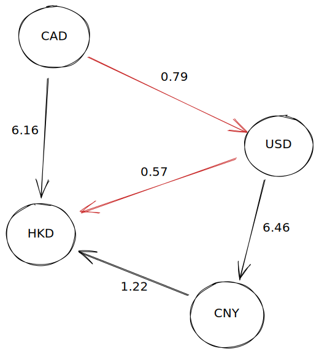

# The best conversion rate | currency-conversion

A TypeScript project to catch currency conversion data and find the best possible rate for conversions.

The `currency data` comes from a local Mock file but can be from an API, for example.

> This software does not have a user interface as the objective it's to exercise the algorithm to calculate the rates.

## Execution

To execute the project, follow the steps:

* Assuming you have the `Node.JS` instaled properly.

### Dependencies

```bash
npm install
```

### Testing

```bash
npm test
```

### Run

```bash
npm start
```

### Result

As a result of the execution, you should find a `data.csv` file in the `output` folder, at the root of the project, showing all shortest paths to convert each currency with their pair.

### Exemple

| **CURRENCY_CODE** | **COUNTRY**         | **AMOUNT** | **PATH**   |
|-------------------|---------------------|------------|------------|
| CAD               | Canada Dollar       | 0.00       | CAD        |
| HKD               | Hong Kong Dollar    | 136.00     | CAD \| USD |
| USD               | USA Dollar          | 79.00      | CAD        |
| CNY               | China Yuan/Renminbi | 725.00     | CAD \| USD |

## Algorithm

For this project was used an implementation of [Dijkstra's](https://en.wikipedia.org/wiki/Dijkstra's_algorithm) algorithm and the whole code can be analysed on the [CurrencyGraph](src/application/currencyGraph.ts) class.

### Implementation

Taking this sample to explain my understanding of this program:



So, by this image, if I would like to convert `100` Canadian dollars to `Hong Kong Dollar`, I can convert by `6.16` value of rate and pay at the end `616` or could be better converting first to `USD` by `0.79` and `0.57` values of rate, paying `136` dollars at the end the operation, **22.08%** less.

## TODO

As this is an exercise program, few improovements can be made before using this in a production version:

* The Dijkstra algorithm implementation can be improved using a `Priority Queue` and change the way that nodes are read;
* It's not clear at this point the correct formula to calculate the rate above the original amount;
* Some nodes doesn't have adjacents as `Cayman Island Dollar` for example (_from the available data_) so in the end of the process there will be some lines without conversion;

> All these points can be discussed more to find better ways to perform the currency conversion through this approach.
